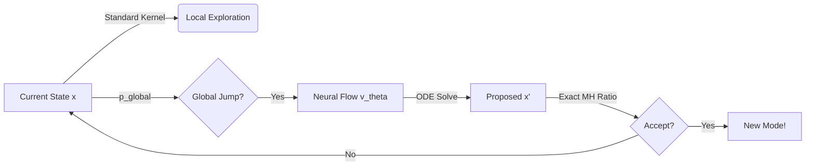
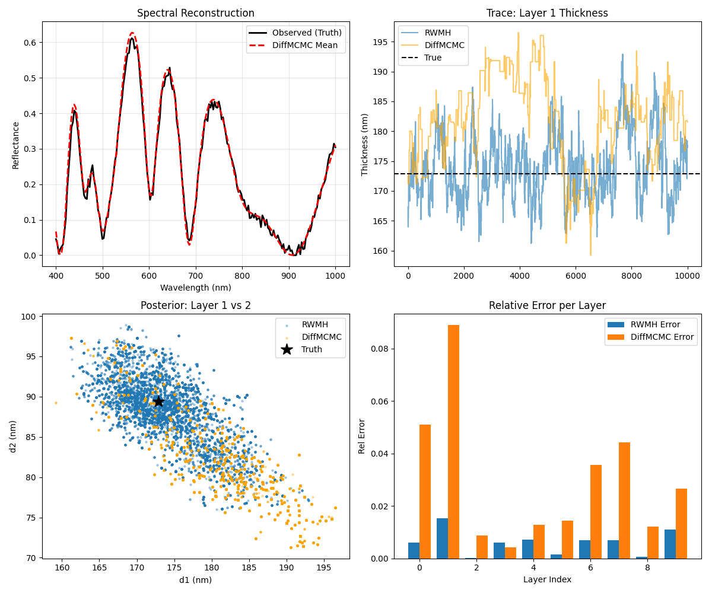

# DiffMCMC: Scaling Exact Inference with Generative AI

> **"What if your MCMC sampler could teleport across the galaxy, but land with mathematical precision every time?"**

**DiffMCMC** is a next-generation Bayesian inference library that combines the creativity of **Flow Matching** (Generative AI) with the rigor of **Exact Metropolis-Hastings**. It allows you to model complex, high-dimensional posteriors by using a neural network as a "global teleporter," proposing massive jumps between disconnected modes while guaranteeing asymptotic correctness.

---

## 🚀 The Big Idea

Standard MCMC (HMC, NUTS) is like walking in the dark: you take small steps to avoid falling off a cliff. 
**DiffMCMC** turns the lights on.

1.  **The Brain (Global Proposal)**: We train a **Continuous Normalizing Flow (rectified flow)** to learn the shape of your target distribution. It learns to transport particles from a simple prior (Gaussian) directly to the high-probability regions of your complex posterior.
2.  **The Guardrail (Exact Correction)**: Neural networks aren't perfect. To ensure we don't introduce bias, we wrap this generative model in a **Metropolis-Hastings** step.
3.  **The Innovation (Deterministic Trace)**: Normally, calculating the exact acceptance probability for a flow is too slow ($O(D^3)$). We use a novel **Fixed-Noise Hutchinson Estimator** that makes it $O(D)$, allowing it to scale to thousands of dimensions without losing exactness.

---

## 🛠️ The Pipeline

How it works under the hood:



-   **Local Kernel**: Keeps exploring the details of the current mode (RWM, MALA).
-   **Global Kernel**: Occasionally activates the flow model to propose a jump to a completely different mode.
-   **Training**: The flow model can be trained offline or during warmup; it should be frozen before sampling for valid diagnostics.

---

## ✅ Guarantees & Inference Modes

DiffMCMC exposes explicit inference modes with contracts and warnings:

- **exact**: Delayed-acceptance with an exact proposal density. Requires a deterministic log density, a valid integration grid, and an exact evaluation of `log q(x)` (e.g. exact trace + optional discrete logdet). If conditions are not met, the sampler warns and falls back to **approx** unless `strict_exactness=True`.
- **pseudo_marginal**: Requires an *unbiased* estimator of `q(x)` with auxiliary randomness. This is not yet provided by `FlowProposal` and will warn/fall back.
- **approx**: Uses approximate `log q` (cheap solvers / trace estimators). Fast, but biased.

For multi-chain runs, adaptation and flow training are restricted to warmup to preserve stationarity in the sampling phase.

## ⚡ Quickstart

Install in seconds:

```bash
pip install -e .
```

Solve a multimodal problem in 20 lines of code:

```python
import torch
from diffmcmc.core.mh import DiffusionMH
from diffmcmc.core.kernels import RWMKernel
from diffmcmc.proposal.flow import FlowProposal

# 1. Define your Target (e.g., a simple bimodal distribution)
def log_prob_fn(x):
    # Two modes at -5 and +5
    return torch.logsumexp(torch.stack([
        -0.5 * (x - 5)**2, 
        -0.5 * (x + 5)**2
    ]), dim=0).sum()

# 2. Initialize the Global Teleporter (Flow)
# deterministic_trace=True makes log_q deterministic; exactness also depends on solver fidelity.
flow = FlowProposal(dim=2, deterministic_trace=True)

# 3. Initialize the Sampler
sampler = DiffusionMH(
    log_prob_fn=log_prob_fn,
    dim=2,
    local_kernel=RWMKernel(scale=1.0),
    global_proposal=flow,
    p_global=0.2  # Try a global jump 20% of the time
)

# 4. Run!
samples, stats = sampler.run(
    initial_x=torch.zeros(2), 
    num_steps=5000
)

print(f"Global Acceptance Rate: {stats['accept_global'] / stats['attempts_global']:.2%}")
```

---

## 🔬 Real-World Application: Photonic Thin-Films

We don't just solve toy problems. `DiffMCMC` is used to invert physical simulations.

**The Challenge**: Given a light spectrum reflected off a multi-layer material, can you determine the thickness of every microscopic layer?
**The Problem**: The solution space is riddled with "fake" local minima. Standard solvers get stuck.
**The DiffMCMC Solution**:

-   **Input**: Noisy Reflection Spectrum (Blue Line).
-   **Task**: Infer 10-layer thicknesses.
-   **Result**: The sampler jumps between valid configurations, recovering the true structure where baselines fail.



*(See `examples/run_photonic_inference.py` for the full code)*

---

## 📦 Features

-   **Rectified Flow Matching**: State-of-the-art straight-path transport.
-   **Hutchinson Trace Estimator**: Linear scaling with dimension ($O(D)$).
-   **Diagnostics**: Geyer ESS, rank-normalized R-hat, and regression tests for delayed-acceptance balance.

---

## 🧰 Config-Driven Runs

Run experiments from a config and store standardized logs:

```bash
diffmcmc-run --config configs/mog.toml
```

The runner saves `config.json`, `stats.json`, and chain arrays under `runs/`.
For multi-chain runs it also writes `diagnostics.json` with R-hat summaries.
-   **PyTorch Native**: Fully differentiable, GPU accelerated.

---

## 🤝 Contributing

We welcome explorers!
1.  Fork it.
2.  Create your feature branch (`git checkout -b feature/TeleporterUpgrade`).
3.  Commit your changes.
4.  Push to the branch.
5.  Open a Pull Request.

---

*Built with probability and <3 by Antigravity.*
